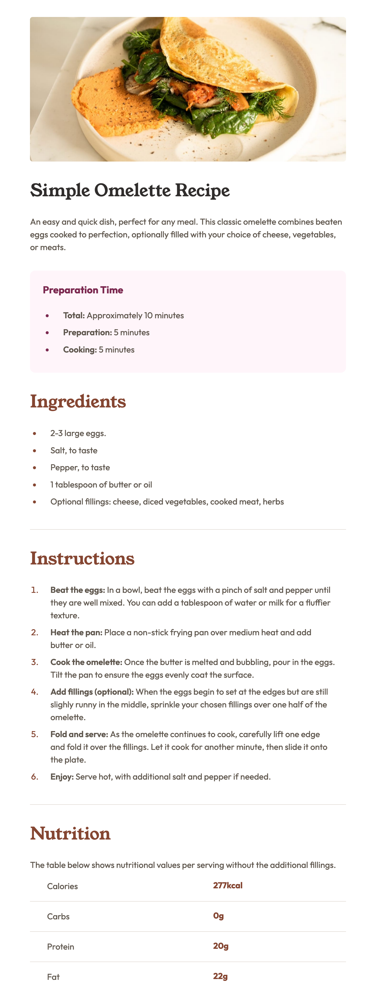

# Frontend Mentor - Recipe page solution

This is a solution to the [Recipe page challenge on Frontend Mentor](https://www.frontendmentor.io/challenges/recipe-page-KiTsR8QQKm). Frontend Mentor challenges help you improve your coding skills by building realistic projects.

## Table of contents

- [Overview](#overview)
  - [The challenge](#the-challenge)
  - [Screenshot](#screenshot)
  - [Links](#links)
- [My process](#my-process)
  - [Built with](#built-with)
- [Author](#author)

## Overview

### Screenshot

### Links

- Solution URL: [solution URL here](https://github.com/priyavrat8065/Omlette-recipe-page.git)
- Live Site URL: [live site URL here](https://priyavrat8065.github.io/Omlette-recipe-page/)

## My process

### Built with

- Semantic HTML5 markup
- CSS custom properties
- Flexbox
- Mobile-first workflow

## Author

- Website - [Priyavrat Chaudhary](https://www.your-site.com)
- Frontend Mentor - [@priyavrat8065](https://www.frontendmentor.io/profile/priyavrat8065)
